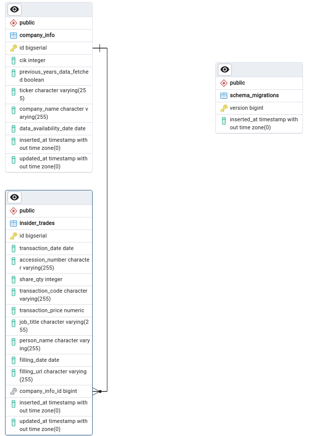
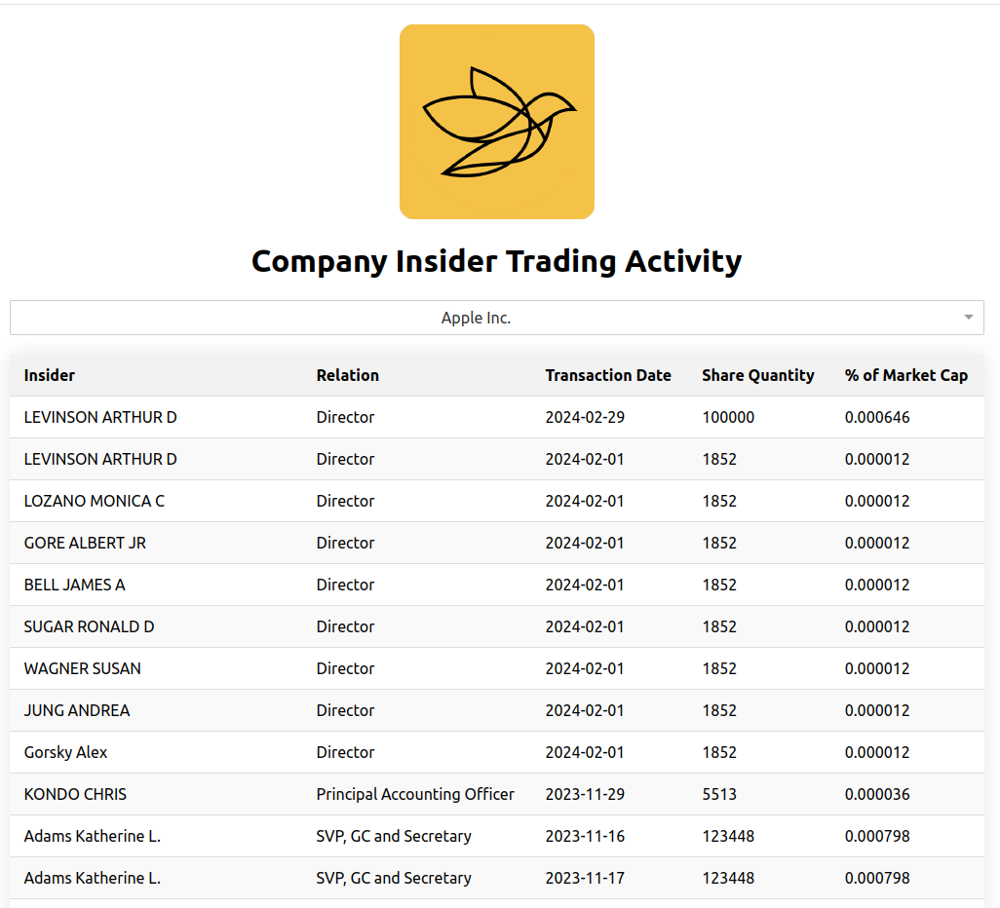

# Insider Trading Info System
The Insider Trading Information System comprises a Web application built with React and a Backend System developed using Elixir Phoenix.


## Table of Contents
- [Insider Trade Info (Backend Service)](#insider-trade-info)
- [Insider Trade Information View (Frontend Web Application)](#insider-trade-information-view)

#### Insider Trade Info System Diagram:


## Insider Trade Info

#### Prerequisite:
To ensure proper functionality, the PostgreSQL database should be operational on port 5432. You can utilize the `docker-compose.yml` file to set up the postgres database in docker container.

### Environment variables

You can refer to this `.env.sample` file and make a duplicate file and set values as per local setup 

Navigate to the project directory: 
```sh
$ cd insider_trading_info
```
To load enviornment values in current terminal:
```sh
$ source .env
```
To add addition company info to fetch insider trade info (**3 companies already added**):

```sh
%{
    cik: 320_193,
    ticker: "AAPL",
    company_name: "Apple Inc.",
    data_availability_date: ~D[2023-01-01] #Fetch data of prevous years
  }
```
**Note:**  Adding company information is the manual process via `seeds.exs`. If a user wishes to retrieve insider trade company info for other companies, they must manually update the `seeds.exs` file with the relevant information and set a new value map in the `company_info_seeds`.

### To start your Phoenix server

- Run `mix setup` to install, setup dependencies and setup the database
- Start Phoenix endpoint with `mix phx.server` or inside IEx with `iex -S mix phx.server`

Now you can visit [`localhost:4000`](http://localhost:4000) from your browser.


---


## External Dependencies

- [**Floki**](https://github.com/philss/floki): Used for parsing HTML and XML content.
- [**Skooma**](https://github.com/bobfp/skooma) : Used for incoming request validation.
- [**Corsica**](https://github.com/whatyouhide/corsica): Used for handling CORS requests.

- [**credo**](https://github.com/rrrene/credo) for linting
- [**mix format**](https://hexdocs.pm/mix/main/Mix.Tasks.Format.html) for automatical code formatting and consistent code style
- [**dialyxir**](https://github.com/jeremyjh/dialyxir) for static type checking

## Implementation details

# Fetching Data from SEC.gov and EDGAR Database

Insider trade data is fetched asynchronously from the SEC.gov website and the EDGAR database. To handle this task efficiently, we utilize a `GenServer` named `SECInsiderTradingDataFetcher`. This specialized server is initiated when the application starts, and its primary responsibility is to execute API requests to **SEC.gov** to retrieve insider trading data for each company.

## Types of Data Fetch

1. **Recent Data Fetch**: This fetch retrieves the most recent insider trade data based on current date range.
   
2. **Previous Year Data Fetch**: This fetch retrieves insider trade data from the previous year up until the specified date in the `company_info` table.

## Implementation Details

The `SECInsiderTradingDataFetcher` GenServer employs a systematic approach to gather data effectively:

- **Fetching Previous Year Data**: The server retrieves previous year data until it reaches the specified date mentioned in the `company_info` table. To manage server load and API restrictions, it fetches a maximum of 100 records for insider trades for each specific company during each fetch cycle.


- **Fetching Recent Data**: Once previous year data is fetched for all companies, the server switches to fetching recent data. It does so with predefined intervals between requests to respect API limitations and maintain a stable connection.

## Steps to Retrieve Data from SEC.gov and the EDGAR Database

Insider trade information is collected through a systematic process involving several steps:

1. **Company filling Search**: The process begins by searching for a company's filings related to trades on the [SEC.gov website](https://www.sec.gov/cgi-bin/browse-edgar?action=getcompany&CIK=1045810).

2. **Filter Entries for Form Type 4/5**: Relevant data is parsed, and `<entry>` tags are filtered based on the Form Type associated with each entry.

3. **Retrieve Filling Details**: Filing date and accession number details are extracted from the filtered entries.

4. **Access Filing Documents**: URLs for the filing documents stored in the EDGAR archive on [SEC.gov](https://www.sec.gov/Archives/edgar/data/) are obtained.

5. **Parse Filing Documents**: Transaction details, including the person's name, job title, share quantity, transaction date, transaction type, and share price, are extracted from the filing documents.

6. **Database Storage**: All collected information is stored in the `insider_trade_info_table` within the PostgreSQL database for further analysis and reference.


### Why the Interval Between Data Fetch?

The decision to include a time gap or interval between data fetch requests is essential for  reason:

- **API Restrictions**: **SEC.gov** API imposes restrictions and limits on incoming requests from the same IP address. Exceeding these thresholds may result in temporary blocks or restrictions. By introducing intervals between requests, we ensure compliance with these limitations and maintain uninterrupted access to the data.

### Usage of Market Cap Information from Yahoo Finance API
We utilize the Yahoo Finance API to obtain the market capitalization value. The concept involves **dynamically calculating** the market capitalization percentage for a specific transaction in **real-time** when a user requests insider trade data. This approach involves using the latest market capitalization value without storing the percentage information in the `insider_trade_info` table for transaction, ensuring that users always have access to the most up-to-date information.

### Insider Trade Info REST APIs

**Endpoint: GET -  /api/insider_trades?ticker={ticker}**


**Sample CURL:**
```CURL
curl --location 'localhost:4000/api/insider_trades?ticker=AAPL'
```

**Sample Response:**
```json
{
    "data": [
        {
            "share_qty": 100000,
            "job_title": "Director",
            "person_name": "LEVINSON ARTHUR D",
            "trade_date": "2024-02-29",
            "market_cap_percentage": "0.000646"
        },
        {
            "share_qty": 1852,
            "job_title": "Director",
            "person_name": "LEVINSON ARTHUR D",
            "trade_date": "2024-02-01",
            "market_cap_percentage": "0.000012"
        },
        {
            "share_qty": 1852,
            "job_title": "Director",
            "person_name": "LOZANO MONICA C",
            "trade_date": "2024-02-01",
            "market_cap_percentage": "0.000012"
        },
        {
            "share_qty": 1852,
            "job_title": "Director",
            "person_name": "GORE ALBERT JR",
            "trade_date": "2024-02-01",
            "market_cap_percentage": "0.000012"
        },
        {
            "share_qty": 1852,
            "job_title": "Director",
            "person_name": "BELL JAMES A",
            "trade_date": "2024-02-01",
            "market_cap_percentage": "0.000012"
        },
        {
            "share_qty": 1852,
            "job_title": "Director",
            "person_name": "SUGAR RONALD D",
            "trade_date": "2024-02-01",
            "market_cap_percentage": "0.000012"
        },
        {
            "share_qty": 1852,
            "job_title": "Director",
            "person_name": "WAGNER SUSAN",
            "trade_date": "2024-02-01",
            "market_cap_percentage": "0.000012"
        },
        {
            "share_qty": 1852,
            "job_title": "Director",
            "person_name": "JUNG ANDREA",
            "trade_date": "2024-02-01",
            "market_cap_percentage": "0.000012"
        },
        {
            "share_qty": 1852,
            "job_title": "Director",
            "person_name": "Gorsky Alex",
            "trade_date": "2024-02-01",
            "market_cap_percentage": "0.000012"
        },
        {
            "share_qty": 5513,
            "job_title": "Principal Accounting Officer",
            "person_name": "KONDO CHRIS",
            "trade_date": "2023-11-29",
            "market_cap_percentage": "0.000036"
        }
    ]
}
```


**Endpoint: GET -  /api/companies**

**Sample CURL:**
```CURL
curl --location 'localhost:4000/api/companies'
```

**Sample Response:**
```json
{
    "data": [
        {
            "ticker": "AAPL",
            "company_name": "Apple Inc."
        },
        {
            "ticker": "NVDA",
            "company_name": "NVIDIA CORP."
        },
        {
            "ticker": "MSFT",
            "company_name": "Microsoft Corporation"
        }
    ]
}
```

#### Database Diagram:




## Insider Trade Information View

This is a single-page application built with React.js that displays insider trade information for public companies. It consumes REST APIs using the Axios library to fetch data from **Insider Trade Info Backend Service** using REST APIs.


## About the Application

The Insider Trade Information App is designed to provide users with access to insider trade information for public companies listed on the SEC website. Users can easily navigate through a list of available companies and select a company from the dropdown menu to view detailed insider trade information.

## Features

- Displays a list of all public companies for which insider trade information is available.
- Allows users to select a company from the dropdown list to view insider trade information for that company.

## How to Use

1. Navigate to the project directory: `cd insider-trade-app`


2. Install dependencies: `npm install`


3. Run the application: `npm start`

4. Open your web browser and navigate to [http://localhost:3000](http://localhost:3000) to view the application.


### Select Company Pge


### List Insider Trades




## Improvement

- Implement pagination or infinite scroll for better performance with large datasets.
- Add search functionality to allow users to search for specific companies.
- Add unit tests
